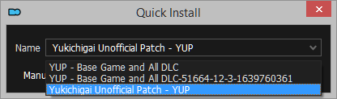
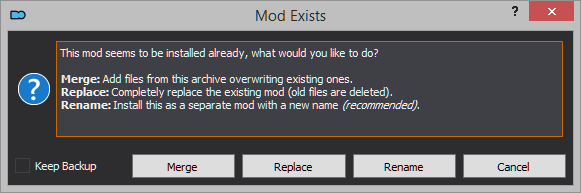
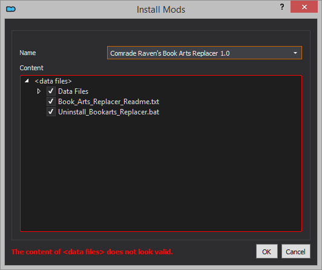

# MODDING TIPS

This page is a collection of modding tips I've gathered over the years. It is split in two sections. The first is a general modding tips section, while the second is a collection of modding tips on how to use certain Mod Organizer 2 features.

## BASIC MODDING TIPS

The following aren't strict rules, but tips to follow if you are new to modding Bethesda games.

- Always keep backup saves, particularly so when uninstalling or installing mods.
- Read mod descriptions. They usually list requirements, compatibility with other mods, and known issues. User comments can also list issues and possible fixes, but take these with a grain of salt. Many users erroneously claim a mod isn't working, because of end user mistakes.
- Don't uninstall or install mods mid-playthrough, unless you know for sure you can do it safely. Mod descriptions and user comments can help you out here.
- Learn how file structure works. Incorrect file structure means mods will not work as intended.
- Register BSA files when appropriate. BSA files contain data files for the mod you are installing, or for other mods to use as a resource. Failing to register your BSA files can cause [**yellow exclamation triangles**](https://external-preview.redd.it/dl-I4l_Pzm5autet-87p1hnU1btUavtiu1mtwGzWBko.png?width=960&crop=smart&auto=webp&s=3d180a6476cad80c332c12be08252511a0044c5c) in Morrowind. This can also happen when a mod you are installing is missing assets.

> ℹ️ To register a BSA file, launch Wrye Mash from Mod Organizer 2. In the **Mods** tab, click the **BSA Archives** tab to the right, and check the BSA you want to register.

## MOD ORGANIZER 2 MODDING TIPS

### Mod manager download installation

Mods downloaded from Nexus will be instantly added to Mod Organizer 2 when using the **Mod manager download** option. However, you still need to install these mods for them to work in-game.

- In MO2, click on the **Downloads** tab. You can check the download progress for your file there.
- Right-click the downloaded file, and click **Install**.
- Click **OK**.
- The mod will appear in the left pane. To activate the mod, check the box next to it by clicking the box.

Whenever you install a mod in Mod Organizer 2, the mod manager assigns it a default name, which is either the name of the Nexus page from where it is being downloaded from, or, when manually installing a mod, the name of the file.

For the purpose of this guide, use the name provided for it in the guide's hyperlink. For example, the guide lists the following mod's name as **Yukichigai Unofficial Patch - YUP**.

### Multiple files installation

There will be times when you will need to install multiple files from a single mod page. Mod Organizer 2 will prompt you with the following box.

What these options do is simple:

- **Merge** merges the contents of the file being installed with those of the file of the same name already installed. The new files will take priority over the old files, overwriting as necessary. This option is generally recommended when installing an update file that is separate from the main file, or optional files in the case you don't want to clutter your mod order.
- **Replace** will delete the installed mod, and install the new mod. This option is generally recommended when installing a new version of a mod, as old files may no longer be used by the new version.
- **Rename** will install the mod under a different name, as a separate, additional mod. This option is generally recommended when installing multiple mods from a single mod page that are unrelated to each other (as is the case of compilation pages that list many mini-mods).

All files installed from a same Nexus page should be merged into a single mod when using Mod Organizer 2. They should also be merged in the order they are listed in this guide, to avoid potential problems (such as update files being overwritten by older files from a same mod). The rule of thumb to use is that one hyperlink in the guide = one single mod on your MO2's left pane.

When the guide asks no specific file to be installed, it is implicit that the file you should download and install is the only main file available for download. Elsewhere, specific instructions will point you in the right direction.

### Manual download installation

Sometimes authors will block the **Mod manager download** option in Nexus, and you will have to download the mod manually. On occasion, you will download a mod from a different site altogether, be it GitHub, Google Drive, or the personal website of a number of authors.

- In MO2, click the **Install a new mod from archive**  button.
- Navigate to the folder where the downloaded file is stored and double click on it.

The rest of the steps work exactly as during mod manager download installation.

### BAIN and FOMOD installers

BAIN and FOMOD installers allow users to customize their install by spliting their mods into multiple options. BAIN installers generally provide a **Core** option which needs to be installed for the mod to work at all, but this option is not always provided, and neither is it always required. FOMOD installers are much more detailed, generally intuitive as opposed to BAIN installers.

Mod Organizer 2 supports both types of mod installers. Note that this guide will always list the options you should install. If missing, the options should be skipped.

### Repackaging mods

There will be times you'll be greeted with the following message when installing a mod through Mod Organizer 2.

In lieu of mod authors not fixing their mods themselves, there are two ways to fix this.

- Repackage the mod yourself and install it through Mod Organizer 2.
- Repackage the mod yourself in Mod Organizer 2.

Mod Organizer 2 recognizes anything resembling a valid file structure (having folders such as **Meshes**, **Textures**, **Icons**, etc., or **.esp** and **.esm** files), allowing you to install it.

In the case shown above, the mod contains a **Data Files** folder and a loose **.txt** file acting as the mod's documentation.

- Right-click on **Data Files**.
- Click **Set as data files directory**.
- Click **OK** to install the mod.

In other cases, mods contain loose assets, and you will have to create folders to package them properly.

- Right-click on the **data files** root directory and click **Create directory...**.
- Enter the name of the folder you want to create, and click **OK**.
- Drag and drop your files in the appropriate folders.
- Click **OK** to install the mod.

### Hiding files

Mod Organizer 2 lets you hide specific files from your installed mods, be it assets or plugins. A hidden plugin is treated as a deactivated plugin, with the bonus that it will no longer clutter your load order. Hiding assets is useful when you don't want to install specific assets, or when you don't want them to overwrite another mod's.

- Right click on your installed mod and click **Information...**.
- On the **Filetree** tab, right click on the plugins, folders, or files you want to hide, and click **Hide**.
- Mod Organizer 2 will hide the files, and these will no longer affect your game.

### The Overwrite folder

The **Overwrite** folder is the destiny folder for a handful of files generated by mods and tools when running the game or using them to mod the game. These include:

- **distantland** folder: includes the distant land generation files created by Morrowind's **MGE XE** executable.
- **MWSE\config** folder: includes configuration files for mods which use **MWSE**.

There's always a chance files in the **Overwrite** folder will overwrite assets and/or plugins from your installed mods, but for the purpose of my modding guides, you don't need to worry about them.
